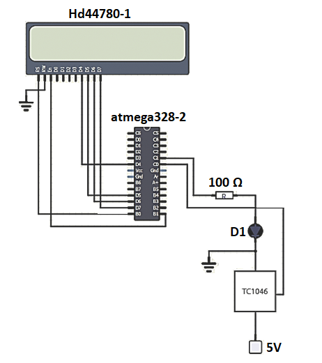
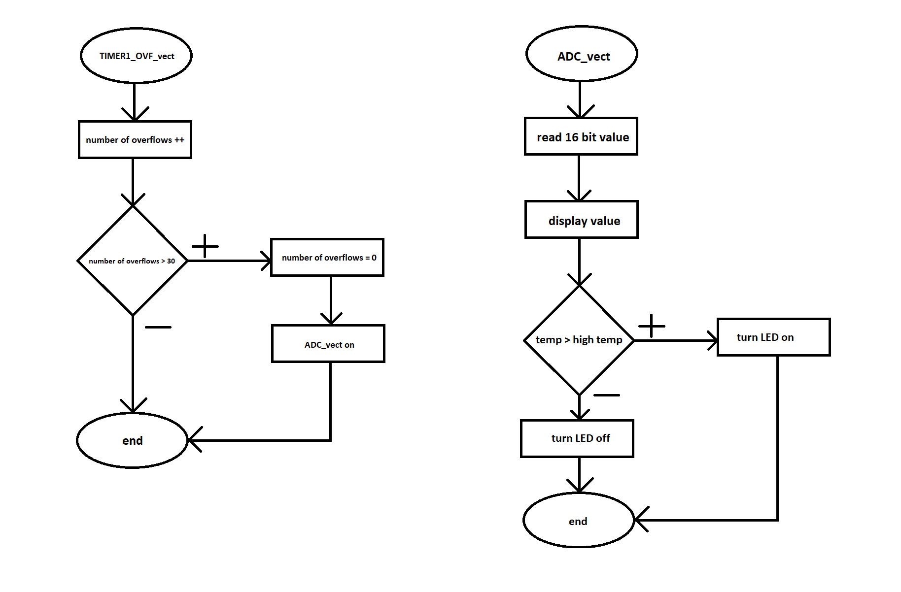

# Lab 5: INSERT_YOUR_FIRSTNAME INSERT_YOUR_LASTNAME

### Analog-to-Digital Conversion

1. Complete table with voltage divider, calculated, and measured ADC values for all five push buttons.

   | **Push button** | **PC0[A0] voltage** | **ADC value (calculated)** | **ADC value (measured)** | **ADC value (measured, hex)** |
   | :-: | :-: | :-: | :-: | :-: |
   | Right  | 0&nbsp;V     |  0   | 0   | 0   |
   | Up     | 0.495&nbsp;V | 101  | 99  | 63  |
   | Down   | 1.203&nbsp;V | 246  | 256 | 100 |
   | Left   | 2.468&nbsp;V | 505  | 410 | 19a |
   | Select | 3.620&nbsp;V | 741  | 640 | 280 |
   | none   | 5.000&nbsp;V | 1023 | 1023| 3ff |

### Temperature meter

Consider an application for temperature measurement. Use analog temperature sensor [TC1046](http://ww1.microchip.com/downloads/en/DeviceDoc/21496C.pdf), LCD, and a LED. Every 30 seconds, the temperature is measured and the value is displayed on LCD screen. When the temperature is too high, the LED will turn on.

2. Draw a schematic of temperature meter. The image can be drawn on a computer or by hand. Always name all components and their values.

   

3. Draw two flowcharts for interrupt handler `TIMER1_OVF_vect` (which overflows every 1&nbsp;sec) and `ADC_vect`. The image can be drawn on a computer or by hand. Use clear descriptions of the individual steps of the algorithms.

   

