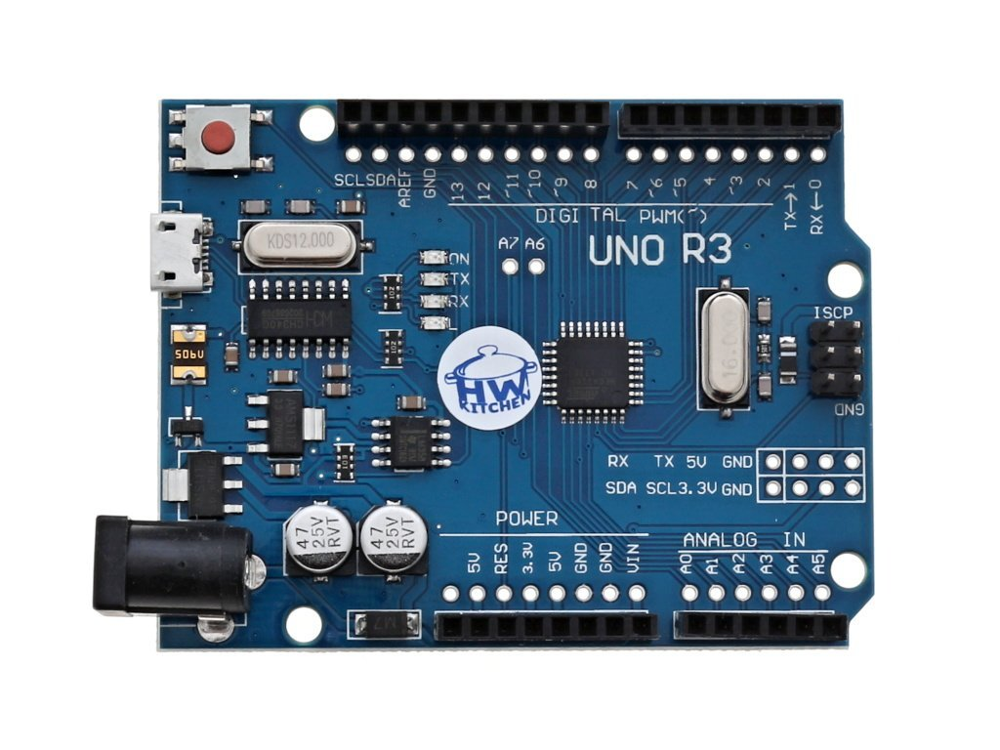

# Communication with multiple modules

### Team members

* Tomáš Kašpar (responsible for coding)
* Dušan Kratochvíl (responsible for documentation and voice narration)

Link to this file in your GitHub repository:

[https://github.com/xkaspa46/digital-electronics-2022/blob/main/labs/project/project.md](https://github.com/...)

### Table of contents

* [Project objectives](#objectives)
* [Hardware](#hardware)
* [Libraries and description of their usage](#libs)
* [Functions](#functions)
  * [Joystick](#joystick)
    * [Position map](#positionmap)
    * [Button detection](#buttondetect)
  * [Encoder](#encoder)
    * [Value counter up/down](#counter)
    * [Alphabet](#alphabet)
* [Video](#video)
* [References](#references)

## Project objectives

Applicaton of modules was set in this order:
- **Communication with**
  * LCD display
  * Analog joystick
  * Rotary encoder
Then the coding itself:
- **Joystick**
  * Mapping current position depending on rotation of joystick
  * Pushbutton function
- **Encoder**
  * Spin (counter)clockwise - UP/DOWN counter
  * Alphabetical increment and counter
- **LCD module**
  * Display of functions

## Brief hardware description and schematics

This section is reserved for a short description of each element our project is composed of. It also includes separated wiring schemes corresponding to each one of used hardware for better orientation.

* **Arduino UNO**

It is a development board consisting of ATmega328 microcontroller, 14 digital GPIO pins (6 PWM), 6 analog input pins, 16 MHz crystal oscilator, built-in pre-defined UART etc. Programmed via USB 2.0, it has 32 kB flash memory (0.5 kB for bootloader).

*Arduino UNO board*

* **Analog Joystick**

*něco na joystick* 

* **Rotary encoder**

*něco na encoder* 

* **Digilent PmodCLP LCD module**

*něco na LCD* 
 

## Libraries and description of their usage

   | **Library name** | **Brief description** | **Usage in our code** |
   | :-: | :-: | :-: |
   | GPIO  | Allowing high performance digital pin access | Setting Input/Output of a pin and reading its values |
   | LCD   | TBD | Initialization of module itself, writing values/strings on exact positions |
   | Timer | Hardware block within an MCU and can be used to measure time events | Determination of refresh time of display and code cycle, interrupt `sei()` |
   | AVR   | TBD | Basic functions for working with registers |

## Functions

Write your text here.

## Video

Write your text here

## References

* [1. GPIO](https://github.com/mikaelpatel/Arduino-GPIO)
* [2. doc.Fryza DE2 - 2022 Labs](https://github.com/tomas-fryza/digital-electronics-2/tree/master/labs)
