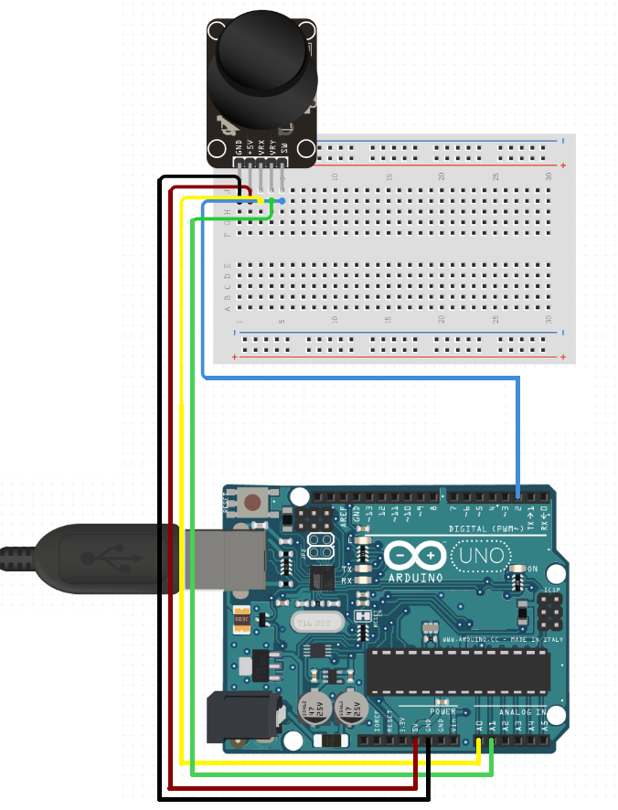

# Communication with multiple modules

### Team members

* Tomáš Kašpar (responsible for coding)
* Dušan Kratochvíl (responsible for documentation and voice narration)

Link to this file in your GitHub repository:

[https://github.com/xkaspa46/digital-electronics-2022/blob/main/labs/project/project.md](https://github.com/...)

### Table of contents

* [Project objectives](#objectives)
* [Hardware](#hardware)
  * [Arudino](#arduinoHW)
  * [Joystick](#joystickHW)
  * [Encoder](#encoderHW)
  * [LCD module](#LCDHW)
* [Libraries and description of their usage](#libs)
* [Functions](#functions)
  * [Joystick](#joystick)
    * [Position map](#positionmap)
    * [Button detection](#buttondetect)
  * [Encoder](#encoder)
    * [Value counter up/down](#counter)
    * [Alphabet](#alphabet)
* [Video](#video)
* [References](#references)

## Project objectives

Applicaton of modules was set in this order:
- **Communication with**
  * LCD display
  * Analog joystick
  * Rotary encoder
Then the coding itself:
- **Joystick**
  * Mapping current position depending on rotation of joystick
  * Pushbutton function
- **Encoder**
  * Spin (counter)clockwise - UP/DOWN counter
  * Alphabetical increment and counter
- **LCD module**
  * Display of functions

## Brief hardware description and schematics

This section is reserved for a short description of each element our project is composed of. It also includes separated wiring schemes corresponding to each one of used hardware for better orientation.

### Arduino UNO

It is a development board consisting of ATmega328 microcontroller, 14 digital GPIO pins (6 PWM), 6 analog input pins, 16 MHz crystal oscilator, built-in pre-defined UART etc. Programmed via USB 2.0, it has 32 kB flash memory (0.5 kB for bootloader). 

*We can see a look of the board below:*

### Analog Joystick

Modules which allows us to monitor a motion of two directions. These directions information is converted  into "position signals" corresponding to X and Y axis. Therefor we have VRx pin for **X-axis** output and similarly **Y-axis**.

*Look of **Joystick board**:*

The constroction itself consists of two potentiometers of 10 kΩ resistivity and pushbutton. It follows that in normal state, both of potentiometers should be in half of their resistivity range which changes with motion in either X or Y direction. The communication with controller is secured by the change of voltage/s.

*Our wiring of an analog **joystick**:*

### Rotary encoder

We can use the picture below in order to understand a simple working principle of a rotary encoder.

> The encoder is made out of disk with evenly spaced contact zones which are connected to a common C pin and two other separate contact pins. -Reference no.4

The desired outcome are two output square wave signals (A & B) muttualy phased by 90 degrees:
Opposite values - if the rotation was clockwise
Same values     - if the rotation was counter clockwise

The sample of a combination is only taken after an edge has occured within signal A as shown in the imageS

*Our wiring of an **encoder**:*

### Digilent PmodCLP LCD module

We are talking about an LCD module that uses its own controller for an easier integration. Positions count up to 32 character in 16 columns and 2 rows. There are 192 predefined characters (93 ASCII) and optionally add-able custom ones.

**LCD displays in general:**
LiquidCrystalDisplay is a thin and flat device consisting of terminal count og colourful or monochromatic pixels lined in front of a light source/reflector. Every pixel is then made of liquid crystal molecules stored between two transparent electrodes and two polarization filtres. 
Their biggest advantage is a considerably small energy consumption and therefor are great for devices running on battery supply. 

*Our wiring of an **LCD module**:*

## Libraries and description of their usage

   | **Library name** | **Brief description** | **Usage in our code** |
   | :-: | :-: | :-: |
   | GPIO  | Allowing high performance digital pin access | Setting Input/Output of a pin and reading its values |
   | LCD   | Necessary functions for controlling the display | Initialization of module itself, writing values/strings on exact positions |
   | Timer | Hardware block within an MCU and can be used to measure time events | Determination of refresh time of display and code cycle, interrupt `sei()` |
   | AVR   | Predefined library of AVR microcontrollers | Basic functions for working with registers |

## Functions

### Joystick
* **Position map**
First of our described functions is situated on the very left side of the display where it shows us via **x:___** and **y:___** corresponding coordinates on an imaginary map. These coordinates are naturally equal to the value meassured by analog inputs **A0** and **A1**. Meassured value can only be from a scale from 0 to 1024. 

Both rising/falling values have an intuitive working mechanism. With a certain inaccuracy in real implemantation - a starting value on *x* and *y* is 511 as shown in a simulation. Moving the joystick to the right, we are incrementing an **x** value. Naturally its decreasing turning the joystick left. Analogically, the **y** value changes with up/down direction.

## Video

Write your text here

## References

* [1. GPIO](https://github.com/mikaelpatel/Arduino-GPIO)
* [2. doc.Fryza DE2 - 2022 Labs](https://github.com/tomas-fryza/digital-electronics-2/tree/master/labs)
* [3. Joystick](https://navody.dratek.cz/navody-k-produktum/arduino-joystick-ps2.html)
* [4. Encoder](https://howtomechatronics.com/tutorials/arduino/rotary-encoder-works-use-arduino/?fbclid=IwAR1UxOQv36Y3HIfpMDaVhkYf1JpnIz0Ywbn_U0N9zagLQHEsaXvEKFfGdwQ)
* [4. Encoder](https://howtomechatronics.com/tutorials/arduino/rotary-encoder-works-use-arduino/?fbclid=IwAR1UxOQv36Y3HIfpMDaVhkYf1JpnIz0Ywbn_U0N9zagLQHEsaXvEKFfGdwQ)
* [5. Digilent official website](https://projects.digilentinc.com/products/pmod-clp)
