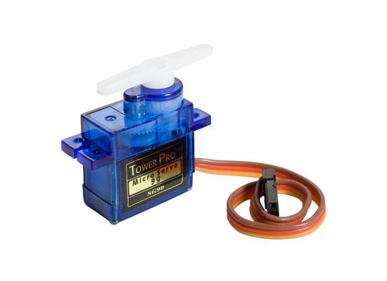
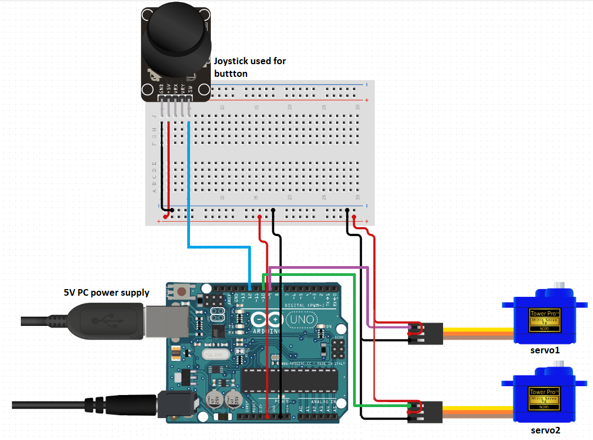
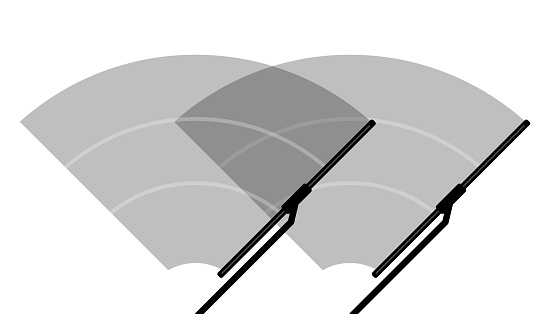

# Wiper drive

### Team members

* Tomáš Kašpar (responsible for documentation and voice narration)
* Dušan Kratochvíl (responsible for coding)

### Table of contents

* [Project objectives](#objectives)
* [Hardware](#hardware)
  * [Servo motor](#servo)
  * [Wiring](#wiring)
* [Software and libraries](#libs)
  * [Source files](#sourcefiles)
  * [Flowcharts](#flowcharts)
* [Function - Wiper drive](#functions)
* [Video](#video)
* [References](#references)

<a name="objectives"></a>

## Project objectives

Applicaton of modules was set in this order:
- **PWM initialization**
- **Wiping servo motor**


<a name="hardware"></a>

## Brief hardware of description Servo motor and schematic

This section is reserved for a short description of an element our project is composed of. It also includes wiring scheme.

<a name="servo"></a>

### Servo motor

* Servo motor, unlike conventional motor is capable of setting the rotation at exact position. Even tho the servo is allowing us to be more accurate, it is also capable of a small rotation speed.
* In our application we use PWM (Phase-Width Modulation) in order to control the end positions.

*We can see a look of a 5V servomotor below:*



<a name="joystickHW"></a>

### Wiring

<a name="wiring"></a>



<a name="libs"></a>

## Software and libraries

   | **Library name** | **Brief description** | **Usage in our code** |
   | :-: | :-: | :-: |
   | GPIO  | Allowing high performance digital pin access | Setting Input/Output of a pin and reading its values |
   | Timer | Hardware block within an MCU and can be used to measure time events | PWM |
   | AVR   | Predefined library of AVR microcontrollers | Basic functions for working with registers |

<a name="sourcefiles"></a>

### Source files & libraries

 1. **Timer:** [timer.h](https://github.com/xkrato62/Digital-electronics_2/blob/main/Labs/project_2/include/timer.h)
 2. **Gpio:** [gpio.c](https://github.com/xkrato62/Digital-electronics_2/blob/main/Labs/project_2/lib/gpio/gpio.c), [gpio.h](https://github.com/xkrato62/Digital-electronics_2/blob/main/Labs/project_2/lib/gpio/gpio.h)
 3. **Source:** [main.c](https://github.com/xkrato62/Digital-electronics_2/blob/main/Labs/project_2/src/main.c)
 4. **Hex** [firmware.hex](https://github.com/xkrato62/Digital-electronics_2/blob/main/Labs/project_2/firmware.hex)

  *Project structure:*
   ```c
   ├── include
   │   └── timer.h
   ├── lib
   │   └── gpio
   │       ├── gpio.c
   │       └── gpio.h
   └── src
       └── main.c
   ```

<a name="flowcharts"></a>

### Software flowcharts


<a name="functions"></a>

## Wiper drive
* In general
  * In our application we consider a servo motor as a driver for a windshield wiper similar to those used in real cars.
  * Nowadays wipers use DC motors with permanent magnets and two push-buttons on end positions to oscilate between these two borders.
  * Considering the servo motor is capable of high accuracy, the push-buttons might not be no longer needed.
 


* Controll
  * If we decide to push the button, the motors start to oscilate between two borders at a certain angle corresponding to real car windshield (about 110°).
  * Second push of the button will then increse the speed by two.
  * Third one will turn off the wipers completely and they will automatically return to a starting position.
  * The whole cycle may start again.


<a name="video"></a>

## Video

[YT video with narration](https://youtu.be/0WYqbr4WcUk)🎞🎥📀

<a name="references"></a>

## References

* [1. GPIO](https://github.com/mikaelpatel/Arduino-GPIO)
* [2. doc. Ing. Fryza Ph.D. DE2 - 2022 Labs](https://github.com/tomas-fryza/digital-electronics-2/tree/master/labs)
* [3. Joystick](https://navody.dratek.cz/navody-k-produktum/arduino-joystick-ps2.html)
* [4. Servo](https://www.electronicwings.com/arduino/servo-motor-interfacing-with-arduino-uno)
